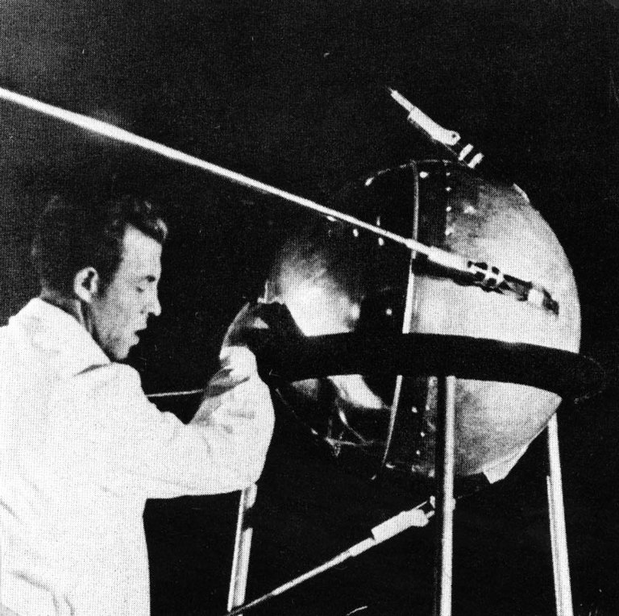
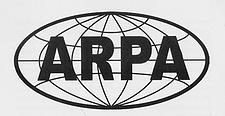
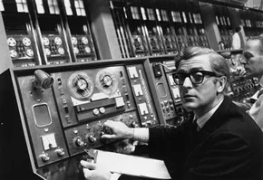
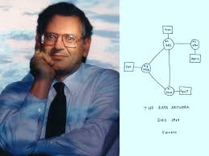
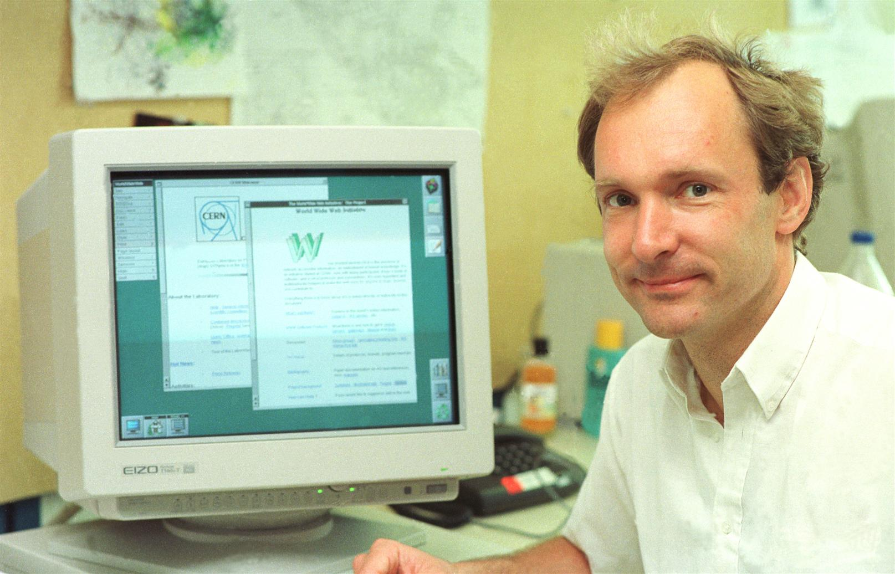
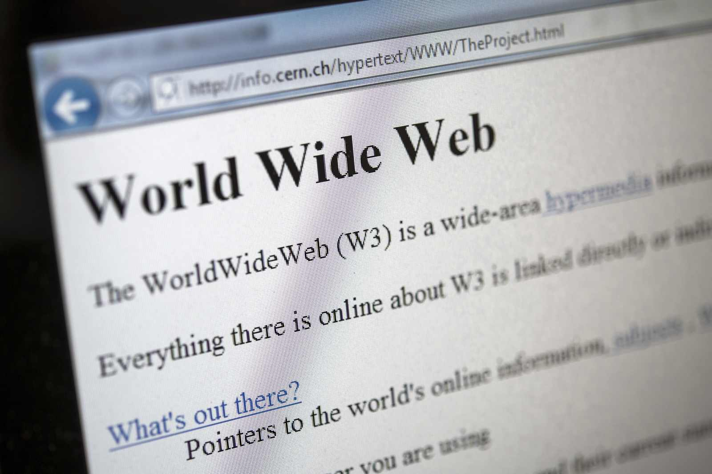

# History of the Internet
"the internet has its origin in the fear of nuclear war"

# 1957-Sputnik I Launched

### The Soviet Union launched Sputnik, Increasing U.S. fears during the Space Race
# 1958-ARPA created

### The United States created ARPA to support advanced research and defens projects
# 1969-ARPANET established

### AEPANET linked four universities and became the foundation for the modern internet
# 1971-First email sent

### Ray Tomlinson sent the first email and helped popularize the use of the @ symbol
# 1972-TCP/IP developed

### Vinton Cerf and Robert kahn developed the communication protocolls that made the network connections more reliable
# 1984-Internet is born

### ARPANET split into MILNET and ARPANET, making a major step in the birth of the Internet
# 1989-World Wide Web invented

### Tim Berners-Lee invented the World Wide Web
# 1991-Web goes public

### The World Wide Web became avaliable to the public