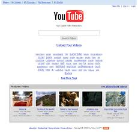
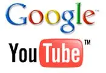
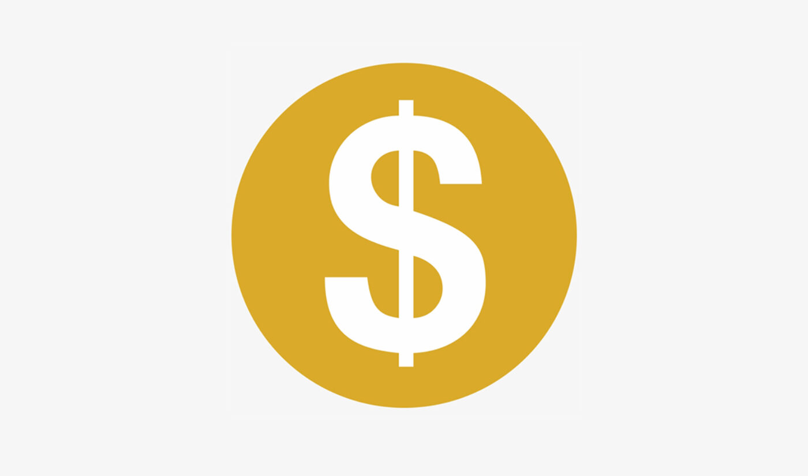
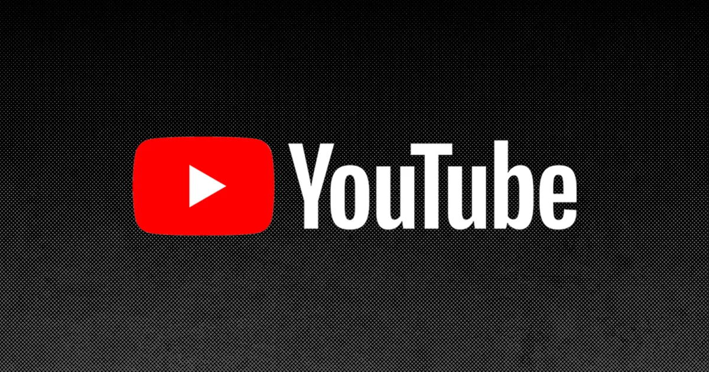

# The History Of Youtube
"YouTube started as a video-sharing platform in 2005 and grew into a global powerhouse under Google"

# 2005-Founding Years

### YouTube's domain, logo, and trademark were registered on February 14, 2005, by founders Chad Hurley, Steve Chen, and Jawed Karim, ex-PayPal employees. The first video, "Me at the Zoo," uploaded on April 23, 2005, lasted 18 seconds
# 2006-Google Acquisition 

### Google bought YouTube for $1.65 billion in October 2006, fueling rapid expansion. Early features included video responses (May 2006), groups (January 2006), and a 10-minute upload limit (March 2006)
# 2007-Monetization and Features

### The Partner Program launched in May 2007, letting creators earn from ads. Live streaming debuted in April 2011, followed by 1080p support (November 2009) and 4K (July 2010). 
# 2014-Subscriptions and Premium

### YouTube Music Key arrived in November 2014, evolving into YouTube Red (October 2015) and Premium (May 2018).
# 2025-Recent Developments

### Milestones include dislike count removal (2021), ad-blocker crackdowns (2023-2024), and AI features like age estimation (2025).