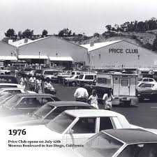
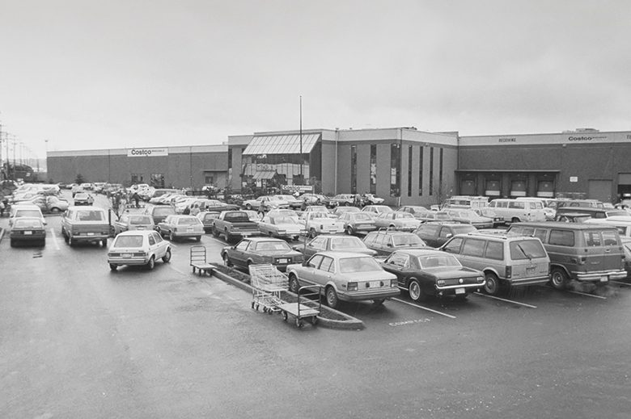
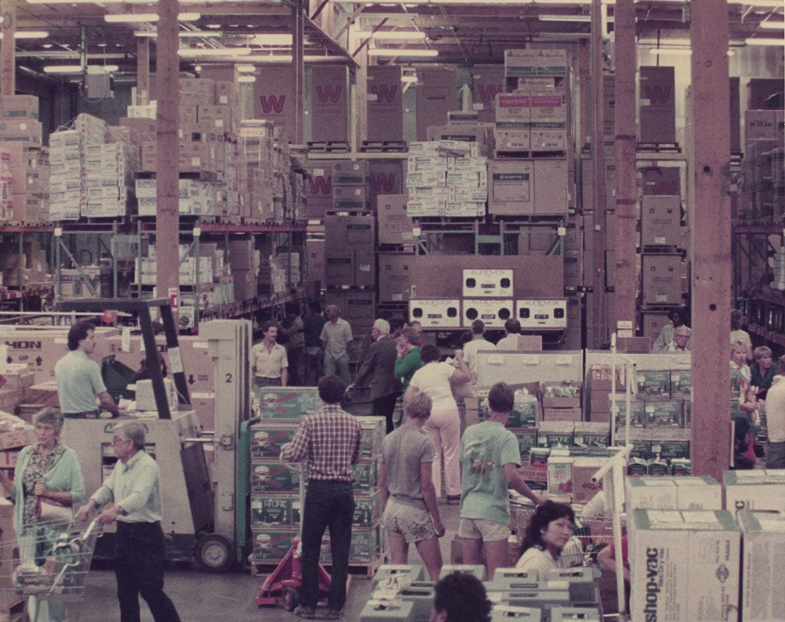
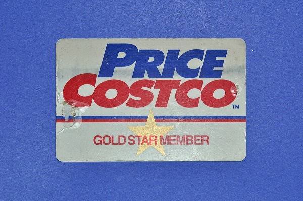
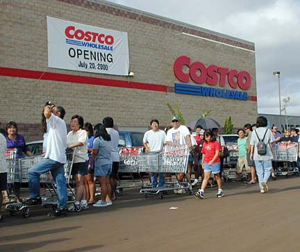
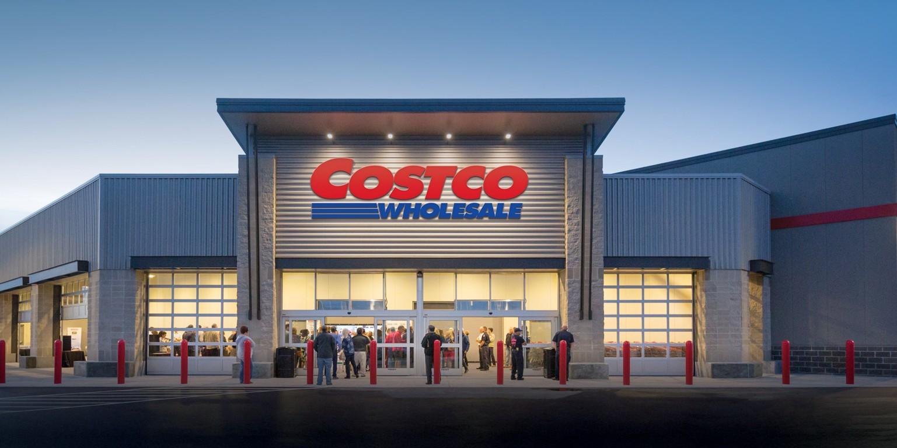

# History of Costco
# Price Club (1976–1982)

### Sol and Robert Price open the first Price Club in a converted airplane hangar on Morena Boulevard in San Diego, California, as a membership warehouse for business customers only.
# Costco Starts (1983–1989)

### The first Costco warehouse opens in Seattle, Washington, on September 15, followed by Portland and Spokane by year-end.Costco rapidly expands across several states, surpasses 200,000 members, and goes public on the NASDAQ in December 1985.
# Rapid Growth and New Services (Late 1980s–Early 1990s) 

### Costco adds pharmacy, fresh meat, produce, bakery, and optical labs, and continues opening new warehouses.
# PriceCostco (1993–1997)

### Price Company (Price Club) and Costco merge to form PriceCostco, with about 206 combined locations and around 16 billion in annual sales.
# Becoming Costco Wholesale (1997–2000s)

### The company changes its corporate name from PriceCostco to Costco Companies, Inc., and later to Costco Wholesale Corporation; “Costco” becomes the primary store name.
# Global Giant Today 

### Costco continues expanding in North America, Europe, and Asia, while Kirkland Signature becomes a major national-brand competitor across many product categories.