# History of my hometown Castroville
"Castroville, CA—Monterey County's second-oldest town after Monterey—is renowned as the "Artichoke Capital of the World" and sits on former Mexican rancho lands amid sloughs and marshes."
# Rancho Era (1820s–1860s)
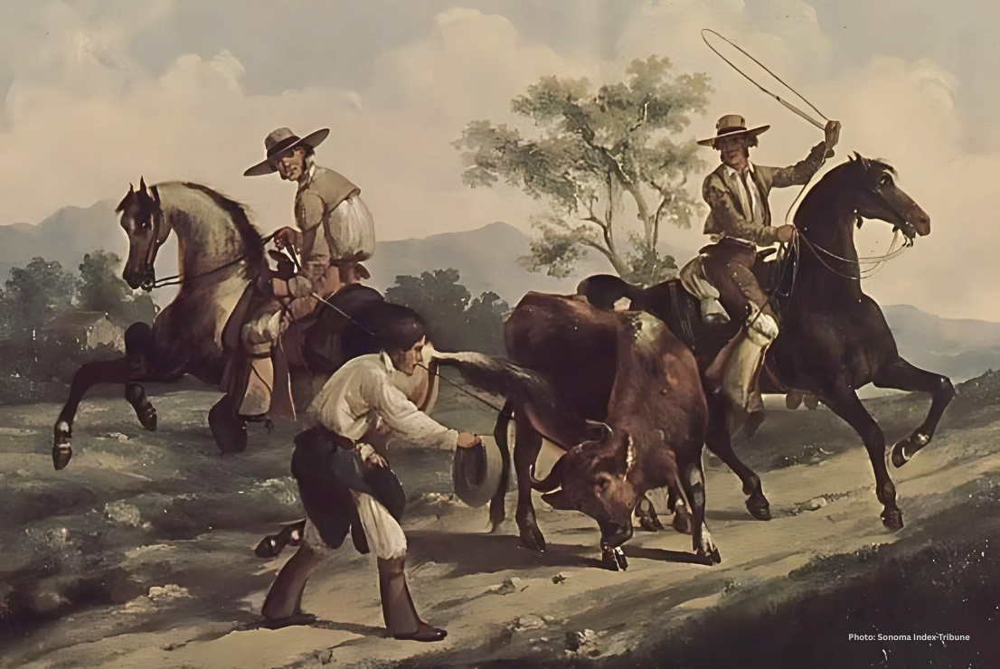
### The area was part of Rancho Bolsa Nueva y Moro Cojo (granted 1822–1844 to families like the Castros and Picos) and nearby grants, used for cattle ranching by Californio rancheros. Spanish settlers introduced early crops; post-1848 American Conquest, wetlands were cleared by Chinese laborers starting 1860.
# Catholic Origins and Construction (Pre-1960)
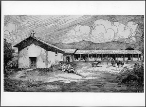
### Mission-era Catholicism reached the Salinas Valley via nearby Soledad Mission (1791) and Monterey presidio chapels, with rancheros like the Castros practicing faith privately amid rancho life. No dedicated Castroville parish existed until post-WWII growth, as immigrants (Japanese, Mexican) boosted population.
# Founding and Early Boom (1863–1900) 
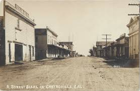
### Juan Bautista Castro (son of Simeon Castro) founds the town as a trading hub for farmers, auctioning lots (50x130 ft) with incentives to build homes. In 1869 Castroville Argus newspaper launches; Castro wins county supervisor seat.1870s: Grows to 900 residents with hotels, stores, saloons, churches, school, brewery; Southern Pacific Railroad arrives, but Salinas wins depot.Late 1800s: Chinatown thrives (McDougall/Speegle Sts); Chinese clear land, farm sugar beets; first creamery (1897).
# Agricultural Rise (1900s–1950s)
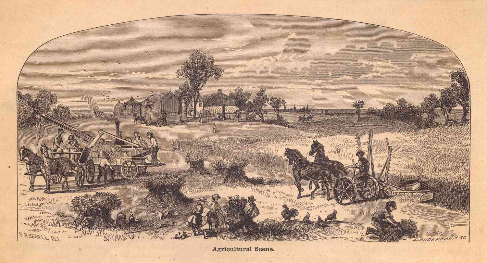
### Japanese, Mexican immigrants arrive via railroad. 1913 Alien Land Law displaces some Asian farmers. 1922: Andrew Molera plants first commercial artichokes; by 1927, 50+ growers on 12,000 acres. 1924: California Artichoke & Vegetable Growers Corp formed.
# Early School Roots (1920s–1940s)
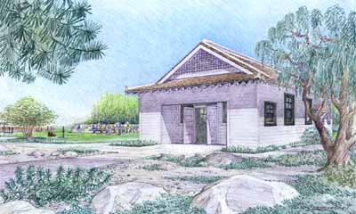
### By 1928 there was already a Castroville grammar/elementary school serving local children, as shown by a 1928 fourth-grade class photo labeled “Castroville Grammar School.”In the mid‑1930s, local Japanese families created a separate Japanese School (after‑school language and culture) on the block bounded by Geil, Pajaro, Seymour, and Union streets, while their children attended public elementary during the day.
# Artichoke Festival Origins and Early Years (1920s–1960s)
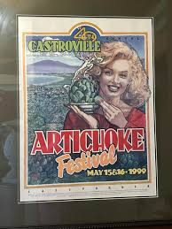
### Artichokes arrived in 1922 (Andrew Molera's first acre); by 1926, Castroville dominated California's crop. Festival evolved from May Days Parade/band contests, adding pancake breakfasts/BBQs. 1959: First Artichoke Festival by Marinovich Marching Units and Castroville Rod & Gun Club. 1961: Joint with Chamber of Commerce; first Artichoke Queen (Sally DeSante). Marilyn Monroe crowned first Honorary Queen in 1948.

# Artichoke boom; Chinese/Japanese contributions (1920s–30s)
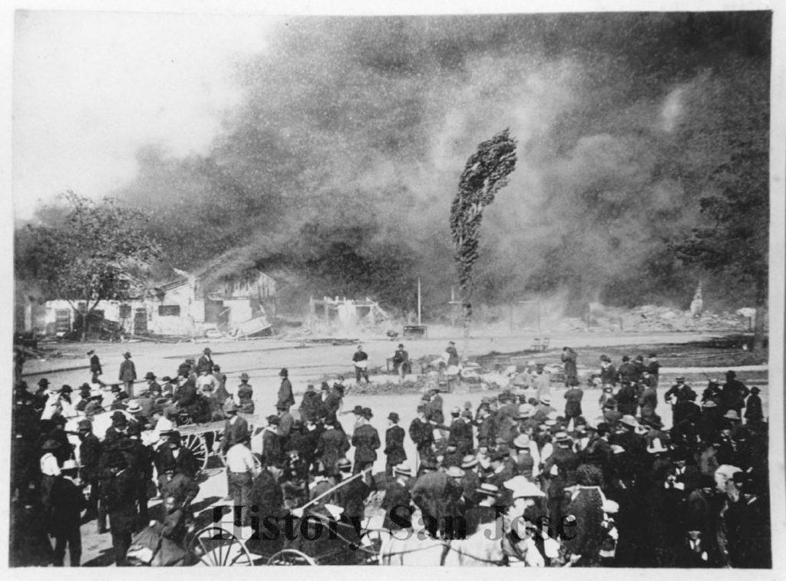
### Anti-Chinese sentiment; Chinatown fires (1883)
# Building the Catholic Church (1960)
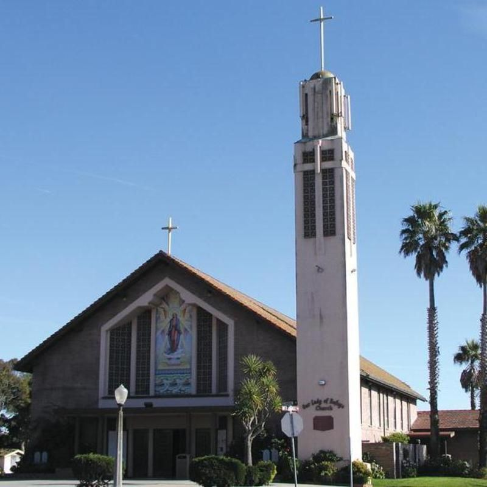
###  Ground-up construction of Our Lady of Refuge Catholic Church at 11140 Preston St (near Hwy 1), designed with a 19-foot exterior mosaic of Our Lady of Refuge by A. Lanzini and Sons. Features include marble altars, stained glass, hand-carved Stations of the Cross, and a reredos with corpus and baldacchino.

# WWII (1940s–1960s) 
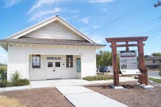
### The Japanese School closed immediately after Pearl Harbor in 1941, and the Japanese community was removed to camps in 1942; the school building stood vacant and later was used as a bunkhouse for returning families after the war. Sometime after WWII, the public Castroville Elementary School acquired that Japanese School building and used it as an extra classroom, folding it into the elementary campus’s life.

# WWII labor shifts; rail hub (1940s–50s) 
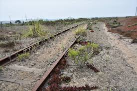
### Wetland drainage; economic pressures
# Catholic Church Developments (1960s–2010s)
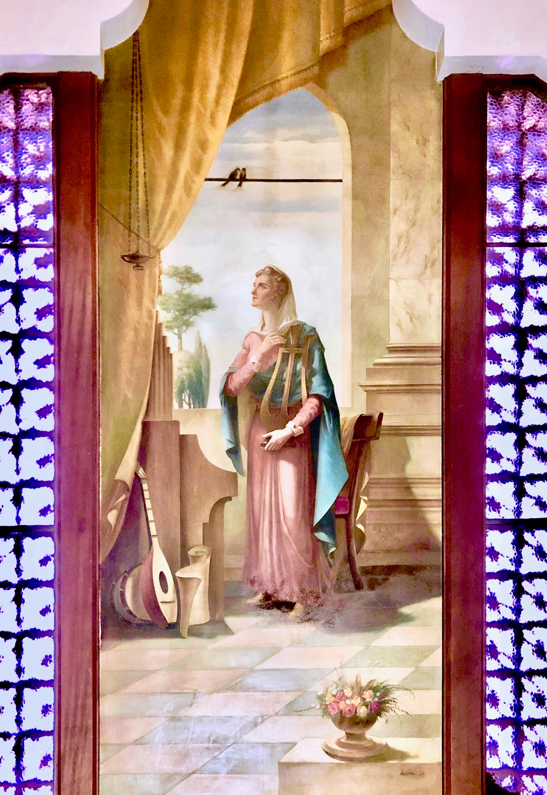
### 1960s–70s: Serves booming farm families; interior mural of St. Cecilia added. 2018: Major restoration by Lanzini—wood/gilding refinished, bronze work, vandal-damaged St. Cecilia mural renewed to original beauty.
# Evolution of the articoke festival (1975-2014)
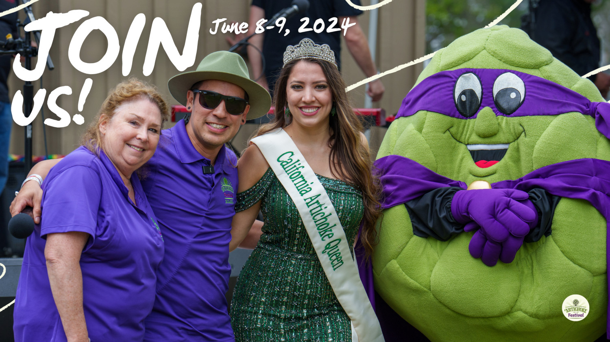
### 1974: First Artichoke King (Andrew O'Desky). 2009: 50th anniversary; peaks at 20,000+ attendees.2014: Moves from Castroville streets to Monterey County Fair & Event Center due to size (parade, cooking demos, wine tasting, car show).
  # Catholic Church Today
  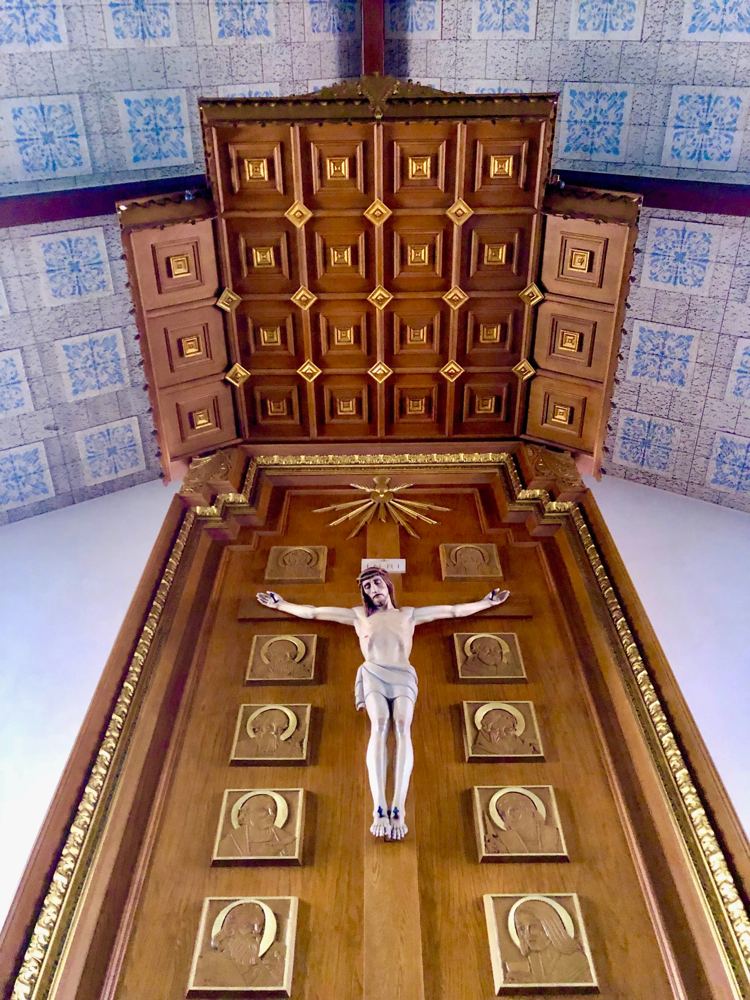
  ### Active parish (olorc.org) with Mass in English/Spanish, tied to North Monterey County USD families like those at Castroville Elementary. Commemorates Castroville's immigrant faith amid artichoke fields
  # Recent Changes to the articoke festival (2020s)
  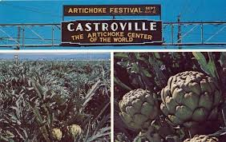
  ### 2024: Smaller events like Bocce Ball Extravaganza (March). 2025: Main festival ends after 65 years (financial/operational strains); nonprofit closes May 9.2026: Local coalition revives as two non-alcoholic events (smaller spring one ~50 vendors; larger fall harvest, possibly Oct/Nov, depending on Merritt St construction).
# Modern Castroville Elementary (1970s–Today)
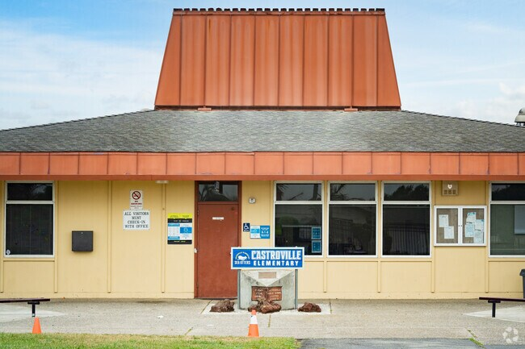
### Over time, the old Japanese School building’s religious/ethnic history faded from memory, and the site became part of a larger effort to improve Castroville Elementary and create a small Japanese School Park to remember the town’s past.Today, Castroville Elementary is a public K‑5 school in the North Monterey County Unified School District, located at 11161 Merritt St, with hundreds of students (a large majority English learners), serving a mostly Latino agricultural community.
# Modern Castroville (1960s–Today) 
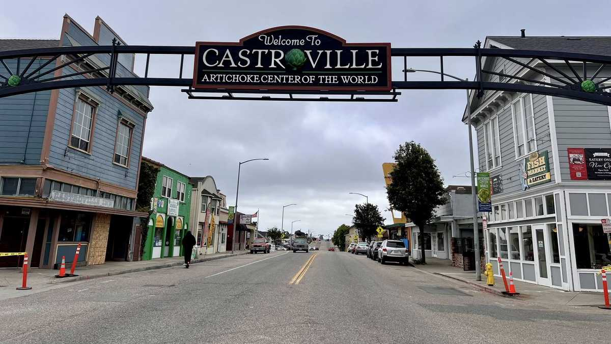
### Population ~7,500 (2020s); historic sites preserved (Castro home, Masonic Lodge, La Scuola school-turned-restaurant). Annual Artichoke Festival draws crowds; economy tied to ag (artichokes, strawberries), tourism, proximity to Salinas/Monterey. Recent: Farm stands like Pezzini Farms highlight local produce.

